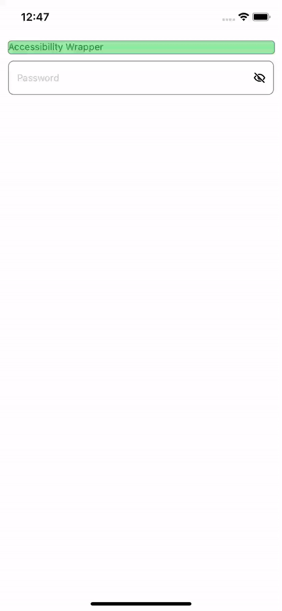

# React Native Accessibility Wrapper

A wrapper for iOS that works as a View and allows you to set the order that elements should be read by Voice Over

---

## Installation

```sh
# Using npm
npm install react-native-accessibility-wrapper

# Using yarn
yarn add react-native-accessibility-wrapper

# Install pods
cd ios && pod install && cd ..
```

---

## Usage

```typescriptreact
import { Text } from 'react-native';
import Icon from 'your-icon-library';
import AccessibilityWrapper from "react-native-accessibility-wrapper";

<AccessibilityWrapper
  style={{ flex: 1, flexDirection: 'row' }}
  elements={[titleRef, leftIconRef, rightIconRef]}
>
  <Icon ref={leftIconRef} name="back" />

  <Text ref={titleRef}>Title</Text>

  <Icon ref={rightIconRef} name="save" />
</AccessibilityWrapper>
```

---

## Example

| Without Wrapper | With Wrapper |
|---|---|
|   |    |

---

## License

MIT
